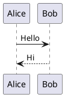

# Markdown Viewer

A lightweight web-based tool for viewing and rendering Markdown documents with embedded PlantUML diagrams and MyST syntax support.

## Features

- Live Markdown preview with GitHub Flavored Markdown (GFM) support
- PlantUML diagram rendering via the official PlantUML public server
- **MyST (Markedly Structured Text) support**: `{tab-set}`, `{tab-item}`, `{grid}`, `{grid-item}`
- Drag-and-drop or file picker to load files; **preview follows the filename suffix**: Markdown (`.md`, `.mdx`, …) is rendered as Markdown; other text/source files are shown as **syntax-highlighted source** only (not parsed as Markdown)
- **Direct file save** with File System Access API (Chrome/Edge)
- Toggle Source/Preview panels (show/hide)
- **Resizable panels** with draggable divider
- SVG or PNG output format for diagrams
- Internal anchor links and external links open in new tabs
- Dark/light mode support (follows system preference)
- Responsive layout

## Quick Start (Standalone)

**No installation required!** Just open `markdown-viewer.html` in your browser.

```
markdown-viewer.html   <- Double-click to open in browser
```

Requirements:
- Modern browser (Chrome, Firefox, Edge, Safari)
- Internet connection (for loading CDN libraries and PlantUML rendering)

## Development Setup

For development with hot-reload and TypeScript:

```bash
# Install dependencies
npm install

# Start development server
npm run dev

# Build for production
npm run build

# Preview production build
npm run preview
```

Requirements:
- Node.js 18+
- Internet connection

## Usage

### Loading files

- **Drag & drop** or **Open**: load a file by name (e.g. `README.md`, `app.py`). The **preview** depends on the **suffix** of the current filename (see Features): Markdown extensions use full Markdown + MyST + diagrams; other supported suffixes use **source preview** (escaped HTML + Prism when a grammar is available).
- **Manual**: You can still type or paste in the editor; the default unsaved document is `document.md` (Markdown preview).

### Preview modes (by extension)

| Filename ends with | Preview behavior |
|--------------------|------------------|
| `.md`, `.mdx`, `.markdown`, `.mdown`, `.mkd`, `.qmd`, `.rmd`, `.mdc` | Full Markdown (GFM), MyST, PlantUML, Mermaid |
| e.g. `.py`, `.ts`, `.json`, `.toml`, `.am` (makefile grammar), `.spec` (YAML grammar), … | Whole buffer as **one code block** with Prism when bundled; **not** parsed as Markdown |
| Exact basename (case-insensitive): `Dockerfile`, `Containerfile`, `Jenkinsfile`, `Makefile`, `GNUmakefile`, `CMakeLists.txt` | **docker**, **docker**, **groovy**, **bash**, **bash**, **cmake** (whole-file source preview) |
| No extension, or a **suffix without** a bundled highlighter map | Same **source preview**; if the first non-empty line is a **shebang** (`#!/usr/bin/bash`, `#!/usr/bin/env python3`, `#!/usr/bin/env node`, `#!/usr/bin/go`, …), Prism language is inferred when it matches a bundled grammar (bash, python, JavaScript, TypeScript, TSX, PowerShell, Go) |

### Show/Hide Panels

Use the **Source** and **Preview** toggle buttons to show or hide each panel.

### Resizable Panels

Drag the divider between Source and Preview panels to adjust their widths.

### Save Files

- **Chrome/Edge**: Click "Save" to save directly to the original file (or use Save As dialog)
- **Other browsers**: Click "Save" to download the file

### PlantUML Syntax

Use fenced code blocks with `plantuml`, `puml`, or `{uml}` language:

````markdown

````

The `@startuml` / `@enduml` tags are optional - they are added automatically if missing:

````markdown
```puml
participant API
API -> API : validate
```
````

MyST-style `{uml}` is also supported:

````markdown
```{uml}
A -> B : request
```
````

### MyST Syntax

Supports MyST (Markedly Structured Text) directives commonly used with Sphinx/Jupyter Book:

#### Tab Set / Tab Item

Create tabbed content panels:

`````markdown
```````{tab-set}
``````{tab-item} Tab 1
Content for tab 1
``````

``````{tab-item} Tab 2
Content for tab 2
``````
```````
`````

#### Grid Layout

Create responsive grid layouts with column spans (based on 12-column system):

`````markdown
`````{grid} 2
````{grid-item}
:outline:
:columns: 3
Left column (25% width)
````
````{grid-item}
:outline:
:columns: 9
Right column (75% width)
````
`````
`````

**Grid options:**
- `:columns: N` - Column span (1-12)
- `:outline:` - Show border around the item

## Deployment

### Option 1: Standalone (Simplest)

Just copy `markdown-viewer.html` to your server or share the file directly. Users can open it in any browser.

### Option 2: Built Version (Optimized)

Build and deploy the `dist/` folder:

```bash
npm run build
```

```
dist/
├── index.html
└── assets/
    ├── index-*.js
    └── index-*.css
```

Serve via any HTTP server (nginx, Apache, IIS, or static hosting).

**Note**: The built version requires HTTP server - opening `dist/index.html` directly from file system won't work.

## Project Structure

```
markdown-plantuml-viewer/
├── markdown-viewer.html    # Single-file version (no build needed)
├── index.html              # Entry HTML (for Vite)
├── package.json            # Dependencies and scripts
├── tsconfig.json           # TypeScript config
├── vite.config.ts          # Vite bundler config
├── src/
│   ├── main.ts             # Application code
│   ├── style.css           # Styles
│   ├── plantuml-encoder.d.ts
│   └── file-system-access.d.ts
├── dist/                   # Build output (generated)
└── node_modules/           # Dependencies (generated)
```

## Dependencies

| Package | Purpose |
|---------|---------|
| marked | Markdown to HTML conversion |
| dompurify | HTML sanitization (XSS protection) |
| plantuml-encoder | PlantUML diagram encoding |
| vite | Build tool and dev server |
| typescript | Type checking |

## License

MIT
