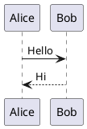

# Markdown Viewer

[中文文档](README.zh-CN.md)

A lightweight, browser-based document editor and renderer for Markdown, PlantUML, and source code files. Features real-time preview, syntax highlighting for 100+ programming languages, and seamless file system integration.

## Features

- **Multi-format document rendering**: Markdown (GFM), PlantUML diagrams, and syntax-highlighted source code for 100+ programming languages
- **Real-time preview**: Live rendering with debounced updates for smooth editing experience
- **Built-in source editor**: Full-featured text editing with syntax highlighting, find & replace, and direct file save
- **PlantUML integration**: Render UML diagrams via the official PlantUML server with automatic `@startuml`/`@enduml` wrapping
- **MyST (Markedly Structured Text) support**: `{tab-set}`, `{tab-item}`, `{grid}`, `{grid-item}` directives
- **File system access**: Drag-and-drop or file picker to load files; direct save with File System Access API (Chrome/Edge)
- **Find & Replace**: In-editor search with regex support, case-sensitive matching, and match navigation
- **Flexible layout**: Resizable split panels with toggleable Source/Preview views
- **Diagram output options**: SVG or PNG format for PlantUML and Mermaid diagrams
- **Smart link handling**: Internal anchors stay in preview; external links open in new tabs; relative file links open in new windows with workspace folder linking
- **Theme support**: Dark/light mode following system preferences
- **Responsive design**: Adaptive layout for various screen sizes

## Quick Start (Standalone)

**No installation required!** Just open `markdown-viewer.html` in your browser.

```
markdown-viewer.html   <- Double-click to open in browser
```

Requirements:
- Modern browser (Chrome, Firefox, Edge, Safari)
- Internet connection (for loading CDN libraries and PlantUML rendering)

## Development Setup

For development with hot-reload and TypeScript:

```bash
# Install dependencies (optional: use mirror to speed up electron download)
npm install

# Start development server
npm run dev

# Build for production
npm run build

# Start production server
npm run server
```

**Speeding up Electron download** (optional, only if default download is slow):

If `npm install` downloads Electron slowly, you can set a mirror:

```bash
# Linux / macOS
export ELECTRON_MIRROR="https://npmmirror.com/mirrors/electron/"
npm install

# Windows PowerShell
$env:ELECTRON_MIRROR="https://npmmirror.com/mirrors/electron/"
npm install

# Windows CMD
set ELECTRON_MIRROR=https://npmmirror.com/mirrors/electron/
npm install
```

Verify the environment variable:

```bash
echo $ELECTRON_MIRROR  # Linux / macOS
echo $env:ELECTRON_MIRROR  # Windows PowerShell
```

Requirements:
- **Node.js 20+** (LTS is fine). **Node.js 22+** is optional but recommended: it avoids an `npm warn EBADENGINE` message from a transitive dependency (`chevrotain@12`, pulled in by Mermaid 11's parser stack). The warning does not block install or builds on Node 20.
- Internet connection

### WebView2 Desktop App (Windows Only)

A native desktop app built with WinUI 3 (Windows App SDK), featuring Windows 11 Mica backdrop effect:

```bash
# Development mode (compile TypeScript and watch Vite)
npm run win

# Build for production (compile, package, generate self-contained MarkdownViewer.exe)
npm run app:build
```

The build output is located in `dist/MarkdownViewer/`. Run `MarkdownViewer.exe` to launch.

**Windows Shortcut** (run in background without a visible terminal window):

```
C:\Windows\System32\WindowsPowerShell\v1.0\powershell.exe -WindowStyle Hidden -Command "& { cd 'D:\workspace\markdown-viewer'; npm.cmd run win }"
```

Requirements:
- Node.js 20+ (same as above)
- **.NET 10 SDK** ([download](https://dotnet.microsoft.com/download/dotnet/10.0))
- WebView2 Runtime installed on the system (pre-installed on Windows 10/11)

Quick install dependencies on Windows:

```bash
winget install OpenJS.NodeJS.LTS
winget install Microsoft.DotNet.SDK.10
```

Notes:
- Windows only
- Build process includes TypeScript compilation, Vite packaging, and .NET publishing
- Build output is `dist/MarkdownViewer/MarkdownViewer.exe` with related resource files


## Usage

### Loading files

- **Drag & drop** or **Open**: load a file by name (e.g. `README.md`, `diagram.puml`, `app.py`). The **preview** depends on the **suffix** of the current filename (see Features): Markdown extensions use full Markdown + MyST + diagrams; `.puml` / `.plantuml` use **whole-file PlantUML** rendering; other supported suffixes use **source preview** (escaped HTML + Prism when a grammar is available).
- **Manual**: You can type or paste in the editor; the default unsaved document is `document.md` (Markdown preview).

### Preview modes (by extension)

| Filename ends with | Preview behavior |
|--------------------|------------------|
| `.md`, `.mdx`, `.markdown`, `.mdown`, `.mkd`, `.qmd`, `.rmd`, `.mdc` | Full Markdown (GFM), MyST, PlantUML (fenced blocks), Mermaid |
| `.puml`, `.plantuml` | **Whole file** treated as PlantUML source (same server as fenced blocks; `@startuml` optional — wrapped when missing) |
| e.g. `.py`, `.ts`, `.json`, `.toml`, `.am` (makefile grammar), `.spec` (YAML grammar), … | Whole buffer as **one code block** with Prism when bundled; **not** parsed as Markdown |
| Exact basename (case-insensitive): `Dockerfile`, `Containerfile`, `Jenkinsfile`, `Makefile`, `GNUmakefile`, `CMakeLists.txt` | **docker**, **docker**, **groovy**, **bash**, **bash**, **cmake** (whole-file source preview) |
| No extension, or a **suffix without** a bundled highlighter map | Same **source preview**; if the first non-empty line is a **shebang** (`#!/usr/bin/bash`, `#!/usr/bin/env python3`, `#!/usr/bin/env node`, `#!/usr/bin/go`, …), Prism language is inferred when it matches a bundled grammar (bash, python, JavaScript, TypeScript, TSX, PowerShell, Go) |

### Show/Hide Panels

Use the **Source** and **Preview** toggle buttons to show or hide each panel.

### Resizable Panels

Drag the divider between Source and Preview panels to adjust their widths.

### Save Files

- **Chrome/Edge**: Click "Save" to save directly to the original file (or use Save As dialog)
- **Other browsers**: Click "Save" to download the file

### Find & Replace

Open the find bar in the source editor panel:

- **Ctrl+F** (Cmd+F on Mac): Open find bar
- **Ctrl+H** (Cmd+H on Mac): Open find bar with replace field
- **Enter**: Find next match
- **Shift+Enter**: Find previous match
- **Esc**: Close find bar

The find bar supports case-sensitive matching and regular expressions.

### PlantUML Syntax

You can open **`.puml` or `.plantuml` files** directly: the editor shows the raw source and the preview renders the diagram via the same PlantUML server as fenced blocks (including automatic `@startuml` / `@enduml` when those tags are omitted).

Use fenced code blocks with `plantuml`, `puml`, or `{uml}` language:

````markdown

```plantuml
@startuml
Alice -> Bob: Hello
Bob --> Alice: Hi
@enduml
```
````

The `@startuml` / `@enduml` tags are optional - they are added automatically if missing:

````markdown
```puml
participant API
API -> API : validate
```
````

MyST-style `{uml}` is also supported:

````markdown
```{uml}
A -> B : request
```
````

### MyST Syntax

Supports MyST (Markedly Structured Text) directives commonly used with Sphinx/Jupyter Book:

#### Tab Set / Tab Item

Create tabbed content panels:

`````markdown
```````{tab-set}
``````{tab-item} Tab 1
Content for tab 1
``````

``````{tab-item} Tab 2
Content for tab 2
``````
```````
`````

#### Grid Layout

Create responsive grid layouts with column spans (based on 12-column system):

`````markdown
`````{grid} 2
````{grid-item}
:outline:
:columns: 3
Left column (25% width)
````
````{grid-item}
:outline:
:columns: 9
Right column (75% width)
````
`````
`````

**Grid options:**
- `:columns: N` - Column span (1-12)
- `:outline:` - Show border around the item

## Deployment

### Option 1: Standalone (Simplest)

Just copy `markdown-viewer.html` to your server or share the file directly. Users can open it in any browser.

### Option 2: Built Version (Optimized)

Build and deploy the `dist/` folder:

```bash
npm run build
```

```
dist/
├── index.html
└── assets/
    ├── index-*.js
    └── index-*.css
```

Serve via any HTTP server (nginx, Apache, IIS, or static hosting).

**Note**: The built version requires HTTP server - opening `dist/index.html` directly from file system won't work.

## Project Structure

```
markdown-plantuml-viewer/
├── markdown-viewer.html    # Single-file version (no build needed)
├── index.html              # Entry HTML (for Vite)
├── package.json            # Dependencies and scripts
├── tsconfig.json           # TypeScript config
├── vite.config.ts          # Vite bundler config
├── src/
│   ├── main.ts             # Application code
│   ├── style.css           # Styles
│   ├── plantuml-encoder.d.ts
│   └── file-system-access.d.ts
├── webview2/               # WebView2 desktop app source (Windows only)
├── dist/                   # Build output (generated)
└── node_modules/           # Dependencies (generated)
```

## Dependencies

| Package | Purpose |
|---------|---------|
| marked | Markdown to HTML conversion |
| dompurify | HTML sanitization (XSS protection) |
| plantuml-encoder | PlantUML diagram encoding |
| vite | Build tool and dev server |
| typescript | Type checking |

## License

**Apache License 2.0**