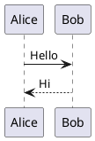

# Markdown Viewer

[English](README.md)

一款轻量级的浏览器端文档编辑器与渲染器，支持 Markdown、PlantUML 及源代码文件。具备实时预览、100+ 编程语言语法高亮，以及无缝的文件系统集成能力。

## 功能特性

- **多格式文档渲染**：支持 Markdown (GFM)、PlantUML 图表，以及 100+ 编程语言的语法高亮
- **实时预览**：带防抖更新的实时渲染，提供流畅的编辑体验
- **内置源代码编辑器**：完整的文本编辑功能，包括语法高亮、查找替换和直接文件保存
- **PlantUML 集成**：通过官方 PlantUML 服务器渲染 UML 图表，自动补全 `@startuml`/`@enduml` 标签
- **MyST (Markedly Structured Text) 支持**：`{tab-set}`、`{tab-item}`、`{grid}`、`{grid-item}` 指令
- **文件系统访问**：拖放或文件选择器加载文件；通过 File System Access API 直接保存（Chrome/Edge）
- **查找与替换**：编辑器内搜索，支持正则表达式、大小写敏感匹配和匹配项导航
- **灵活布局**：可调整大小的分屏面板，可切换源代码/预览视图
- **图表输出选项**：支持 SVG 或 PNG 格式的 PlantUML 和 Mermaid 图表
- **智能链接处理**：内部锚点保留在预览中；外部链接在新标签页打开；相对文件链接在新窗口中打开，支持工作区文件夹关联
- **主题支持**：跟随系统偏好的深色/浅色模式
- **响应式设计**：自适应各种屏幕尺寸的布局

## 快速开始（单文件模式）

**无需安装！** 直接在浏览器中打开 `markdown-viewer.html` 即可使用。

```
markdown-viewer.html   <- 双击在浏览器中打开
```

环境要求：
- 现代浏览器（Chrome、Firefox、Edge、Safari）
- 网络连接（用于加载 CDN 库和 PlantUML 渲染）

## 开发环境搭建

支持热重载和 TypeScript 的开发环境：

```bash
# 安装依赖
npm install

# 启动开发服务器
npm run dev

# 构建生产版本
npm run build

# 启动生产服务器
npm start
```

环境要求：
- **Node.js 20+**（LTS 版本即可）。**Node.js 22+** 为可选但推荐版本：可避免来自传递依赖（`chevrotain@12`，由 Mermaid 11 的解析器栈引入）的 `npm warn EBADENGINE` 警告。该警告不会阻止在 Node 20 上的安装或构建。
- 网络连接

### WebView2 桌面应用（仅 Windows）

基于 WinUI 3 (Windows App SDK) 的原生桌面应用，支持 Windows 11 Mica 背景效果：

```bash
# 开发模式（连接 Vite 开发服务器）
npm run webview2:dev

# 构建生产版本（自包含单文件，无需 .NET 运行时）
npm run webview2:build
```

构建产物位于 `dist/webview2/`，运行 `MarkdownViewer.exe` 即可。

环境要求：
- Node.js 20+（同上）
- **.NET 10 SDK**（[下载](https://dotnet.microsoft.com/download/dotnet/10.0)）
- 系统已安装 WebView2 Runtime（Windows 10/11 已预装）

Windows 快速安装依赖：

```bash
winget install OpenJS.NodeJS.LTS
winget install Microsoft.DotNet.SDK.10
```

限制：
- 仅支持 Windows 平台
- 产物为 `MarkdownViewer.exe` + `dist/` 文件夹，非单个可执行文件

## 使用说明

### 加载文件

- **拖放** 或 **打开**：按文件名加载文件（如 `README.md`、`diagram.puml`、`app.py`）。**预览模式** 取决于当前文件名的 **后缀**（参见功能特性）：Markdown 扩展名使用完整的 Markdown + MyST + 图表渲染；`.puml` / `.plantuml` 使用 **整文件 PlantUML** 渲染；其他支持的后缀使用 **源代码预览**（转义 HTML + 可用的 Prism 语法高亮）。
- **手动输入**：你也可以在编辑器中输入或粘贴内容；默认未保存的文档为 `document.md`（Markdown 预览模式）。

### 预览模式（按扩展名）

| 文件名后缀 | 预览行为 |
|-----------|---------|
| `.md`、`.mdx`、`.markdown`、`.mdown`、`.mkd`、`.qmd`、`.rmd`、`.mdc` | 完整 Markdown (GFM)、MyST、PlantUML（围栏代码块）、Mermaid |
| `.puml`、`.plantuml` | **整文件** 作为 PlantUML 源码处理（与围栏代码块使用相同服务器；`@startuml` 可选 — 缺失时自动补全） |
| 如 `.py`、`.ts`、`.json`、`.toml`、`.am`（makefile 语法）、`.spec`（YAML 语法）等 | 整个缓冲区作为 **一个代码块** 使用 Prism 语法高亮；**不** 作为 Markdown 解析 |
| 精确文件名（不区分大小写）：`Dockerfile`、`Containerfile`、`Jenkinsfile`、`Makefile`、`GNUmakefile`、`CMakeLists.txt` | 分别使用 **docker**、**docker**、**groovy**、**bash**、**bash**、**cmake** 语法高亮（整文件源代码预览） |
| 无扩展名，或 **没有** 内置高亮器映射的后缀 | 同样的 **源代码预览**；如果第一个非空行是 **shebang**（`#!/usr/bin/bash`、`#!/usr/bin/env python3`、`#!/usr/bin/env node`、`#!/usr/bin/go` 等），则根据匹配的内置语法推断 Prism 语言（bash、python、JavaScript、TypeScript、TSX、PowerShell、Go） |

### 显示/隐藏面板

使用 **源代码** 和 **预览** 切换按钮来显示或隐藏各个面板。

### 可调整大小的面板

拖动源代码和预览面板之间的分隔条来调整它们的宽度。

### 保存文件

- **Chrome/Edge**：点击"保存"直接保存到原文件（或使用另存为对话框）
- **其他浏览器**：点击"保存"下载文件

### 查找与替换

在源代码编辑器面板中打开查找栏：

- **Ctrl+F**（Mac 上为 Cmd+F）：打开查找栏
- **Ctrl+H**（Mac 上为 Cmd+H）：打开查找栏并显示替换字段
- **Enter**：查找下一个匹配项
- **Shift+Enter**：查找上一个匹配项
- **Esc**：关闭查找栏

查找栏支持大小写敏感匹配和正则表达式。

### PlantUML 语法

你可以直接打开 **`.puml` 或 `.plantuml` 文件**：编辑器显示原始源码，预览通过相同的 PlantUML 服务器渲染图表（包括在省略 `@startuml` / `@enduml` 标签时自动补全）。

使用 `plantuml`、`puml` 或 `{uml}` 语言的围栏代码块：

````markdown

````

`@startuml` / `@enduml` 标签是可选的 — 缺失时会自动补全：

````markdown
```puml
participant API
API -> API : validate
```
````

也支持 MyST 风格的 `{uml}`：

````markdown
```{uml}
A -> B : request
```
````

### MyST 语法

支持 Sphinx/Jupyter Book 常用的 MyST (Markedly Structured Text) 指令：

#### Tab Set / Tab Item

创建选项卡式内容面板：

`````markdown
```````{tab-set}
``````{tab-item} Tab 1
Content for tab 1
``````

``````{tab-item} Tab 2
Content for tab 2
``````
```````
`````

#### 网格布局

创建带有列跨度的响应式网格布局（基于 12 列系统）：

`````markdown
`````{grid} 2
````{grid-item}
:outline:
:columns: 3
左列（25% 宽度）
````
````{grid-item}
:outline:
:columns: 9
右列（75% 宽度）
````
`````
`````

**网格选项：**
- `:columns: N` - 列跨度（1-12）
- `:outline:` - 显示项目边框

## 部署

### 方案一：单文件模式（最简单）

只需将 `markdown-viewer.html` 复制到你的服务器或直接分享该文件。用户可以在任何浏览器中打开。

### 方案二：构建版本（优化版）

构建并部署 `dist/` 目录：

```bash
npm run build
```

```
dist/
├── index.html
└── assets/
    ├── index-*.js
    └── index-*.css
```

通过任何 HTTP 服务器（nginx、Apache、IIS 或静态托管服务）提供服务。

**注意**：构建版本需要 HTTP 服务器 — 直接从文件系统打开 `dist/index.html` 无法正常工作。

## 项目结构

```
markdown-plantuml-viewer/
├── markdown-viewer.html    # 单文件版本（无需构建）
├── index.html              # 入口 HTML（用于 Vite）
├── package.json            # 依赖和脚本
├── tsconfig.json           # TypeScript 配置
├── vite.config.ts          # Vite 打包配置
├── src/
│   ├── main.ts             # 应用代码
│   ├── style.css           # 样式
│   ├── plantuml-encoder.d.ts
│   └── file-system-access.d.ts
├── webview2/               # WebView2 桌面应用源码（仅 Windows）
├── dist/                   # 构建输出（自动生成）
└── node_modules/           # 依赖（自动生成）
```

## 依赖

| 包名 | 用途 |
|------|------|
| marked | Markdown 转 HTML |
| dompurify | HTML 消毒（XSS 防护） |
| plantuml-encoder | PlantUML 图表编码 |
| vite | 构建工具和开发服务器 |
| typescript | 类型检查 |

## 许可证

**Apache License 2.0**